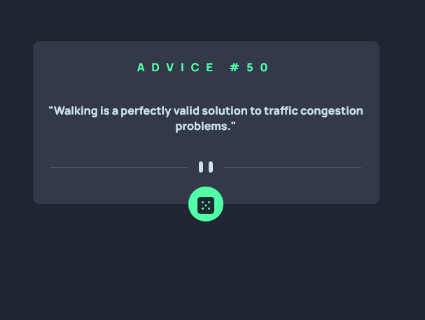

# Frontend Mentor - Advice generator app solution

This is a solution to the [Advice generator app challenge on Frontend Mentor](https://www.frontendmentor.io/challenges/advice-generator-app-QdUG-13db). Frontend Mentor challenges help you improve your coding skills by building realistic projects.

## Table of contents

- [Overview](#overview)
  - [The challenge](#the-challenge)
  - [Screenshot](#screenshot)
  - [Links](#links)
- [My process](#my-process)
  - [Built with](#built-with)
  - [What I learned](#what-i-learned)
  - [Continued development](#continued-development)
  - [Useful resources](#useful-resources)
- [Author](#author)

**Note: Delete this note and update the table of contents based on what sections you keep.**

## Overview

### The challenge

Users should be able to:

- View the optimal layout for the app depending on their device's screen size
- See hover states for all interactive elements on the page
- Generate a new piece of advice by clicking the dice icon

### Screenshot



### Links

- Solution URL: (https://github.com/kanatos-kun/Advice-generator-app)
- Live Site URL: (https://hardcore-jennings-56513a.netlify.app/)

## My process

### Built with

- HTML5 markup
- CSS custom properties
- Javascript

### What I learned

during this little challenge i've learn how to use css box-shadow

```css
.btn:hover {
  box-shadow: 0px 0px 40px hsl(150, 100%, 66%);
}
```

and how to center element very simply !

```css
.btn {
  margin: auto;
}
```

this challenge help me to having confidence in my skills !
It's help me to understand better the fetch() command from javascript

```js
async function startFetchingQuote() {
  await fetch("https://api.adviceslip.com/advice")
    .then(function (res) {
      return res.json();
    })
    .then(function (data) {
      randomQuote.innerHTML = `"${data.slip.advice}"`;
      adviceNumber.innerHTML = `ADVICE #${data.slip.id}`;
    });
}
```

### Continued development

I want to createeven more beautiful website, that first challenge help me to create something very appealing and i love it !

### Useful resources

- [w3school](https://www.w3schools.com/) - This helped me for the box-shadow in css.
- [mdn](https://developer.mozilla.org/en-US/) - This help me for understanding the fetch( ) method and window.onload.

## Author

- Website - [blog de jojoffrey](http://blogdejojoffrey.fr/)
- Frontend Mentor - (https://www.frontendmentor.io/profile/kanatos-kun)
- Twitter - [@jojoffrey1](https://twitter.com/Jojoffrey1)
